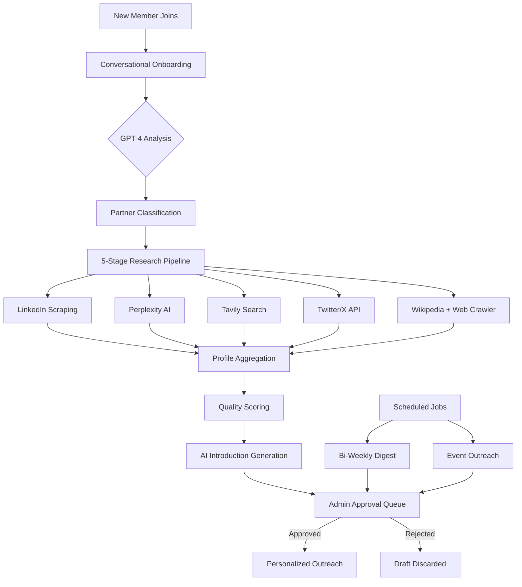

# Sentinel

[](https://nodejs.org/)
[](https://slack.dev/bolt-js/)
[](https://openai.com/)
[](https://www.postgresql.org/)
[](LICENSE)

AI-powered Slack bot for intelligent community management — automated onboarding, multi-source research pipeline, personalized outreach with human-in-the-loop approval.

---

## Architecture



## Features

### Conversational Onboarding
Multi-turn GPT-4 powered intake flow that classifies new members (VC, Corporate, Community Builder, Angel) through natural conversation, then triggers the research pipeline automatically.

### 5-Stage Research Pipeline
1. **Data Collection** — Parallel scraping across LinkedIn, Perplexity AI, Tavily, Twitter/X, Wikipedia, and web crawlers
2. **Citation Crawling** — Follows references from initial results to build a complete picture
3. **Quality & Fact Checking** — Cross-references claims across sources, flags contradictions
4. **Profile Aggregation** — Merges data into a unified professional profile with confidence scores
5. **Introduction Generation** — GPT-4 synthesizes a personalized introduction with key talking points

### LinkedIn Intelligence
- Session persistence with 30-day cookie caching (3x fewer logins)
- Account pooling across 12+ accounts with intelligent rotation
- Automated email verification via Gmail IMAP
- AES-256-GCM encrypted credential storage
- Rate limiting (75 scrapes/day/account) with configurable cooldowns

### Event Outreach
Generates personalized event invitations for each member based on their profile and interests. Every message passes through the admin approval queue — the bot never sends unsanctioned communications.

### Bi-Weekly Digest
Automated community digest with highlights, event recaps, new member spotlights, and featured content. Scheduled delivery with admin review before distribution.

### Human-in-the-Loop Approval
All outgoing communications are drafted and queued in `#bot-admin` for explicit approval. Admins can edit, approve, or reject any message before it reaches members.

---

## Tech Stack

| Component | Technology |
|-----------|-----------|
| Runtime | Node.js 20+ |
| Framework | Slack Bolt SDK (Socket Mode) |
| AI | OpenAI GPT-4 / GPT-4o |
| Research | Perplexity AI, Tavily, Twitter API v2, Wikipedia |
| Database | PostgreSQL + Prisma ORM |
| Scraping | Python Selenium + Chromium |
| Email | Gmail IMAP (verification automation) |
| Security | AES-256-GCM encryption |
| Scheduling | node-cron |
| Logging | Pino |
| Deployment | Railway (Nixpacks) |

## Project Structure

```
sentinel/
├── src/
│   ├── index.js                  # Server initialization
│   ├── app.js                    # Bolt app configuration
│   ├── config/                   # Environment & settings
│   ├── listeners/
│   │   ├── events/               # member_joined, app_home_opened
│   │   ├── messages/             # DM conversation handler
│   │   ├── actions/              # Approval buttons, modals
│   │   └── commands/             # Slash command router
│   ├── services/
│   │   ├── openai.js             # GPT-4 integration
│   │   ├── database.js           # Prisma operations
│   │   ├── slack.js              # Slack API helpers
│   │   ├── scheduler.js          # Cron job management
│   │   └── research/
│   │       ├── index.js          # Pipeline orchestrator
│   │       ├── accountPool.js    # LinkedIn account rotation
│   │       ├── sessionManager.js # Session persistence + encryption
│   │       ├── emailVerification.js
│   │       ├── linkedin.js
│   │       ├── perplexity.js
│   │       ├── tavily.js
│   │       ├── twitter.js
│   │       ├── wikipedia.js
│   │       ├── crawler.js        # Citation web crawler
│   │       ├── aggregator.js     # Multi-source profile merger
│   │       ├── qualityScorer.js  # Cross-reference validation
│   │       └── introGenerator.js # AI introduction synthesis
│   ├── prompts/                  # System prompt templates
│   ├── templates/                # Slack Block Kit templates
│   └── utils/
├── prisma/
│   └── schema.prisma             # Database schema
├── scripts/
│   └── scrape_linkedin.py        # Selenium scraper
└── docs/                         # Setup & architecture guides
```

## Quick Start

### Prerequisites

- Node.js 20+
- PostgreSQL
- Slack workspace (Pro or Business+)
- OpenAI API key

### Installation

```bash
git clone https://github.com/JiwaniZakir/sentinel.git
cd sentinel
npm install

# Configure environment
cp .env.example .env
# Edit .env with your credentials

# Set up database
npx prisma generate
npx prisma db push

# Start (Socket Mode)
npm run dev
```

### Slack App Setup

1. Create app at [api.slack.com/apps](https://api.slack.com/apps)
2. Enable Socket Mode
3. Add Bot Token Scopes: `channels:join`, `channels:manage`, `channels:read`, `chat:write`, `chat:write.public`, `groups:read`, `groups:write`, `im:history`, `im:read`, `im:write`, `users:read`, `users:read.email`, `commands`, `files:write`
4. Subscribe to events: `team_join`, `member_joined_channel`, `app_home_opened`, `message.im`
5. Install to workspace

### Slash Commands

| Command | Description |
|---------|------------|
| `/sentinel help` | Show available commands |
| `/sentinel intro` | Start/redo onboarding |
| `/sentinel events` | View upcoming events |
| `/sentinel announce-event` | Create event outreach (admin) |
| `/sentinel send-digest` | Generate community digest (admin) |
| `/sentinel add-highlight <text>` | Add to digest (admin) |
| `/sentinel partner-stats` | View pipeline statistics (admin) |

## Research Pipeline Setup

The research pipeline is optional but provides the most value. To enable LinkedIn intelligence:

1. Generate an encryption key: `/sentinel linkedin-generate-key`
2. Add LinkedIn accounts to the pool (see [docs/LINKEDIN_SESSION_MANAGER_QUICKSTART.md](docs/LINKEDIN_SESSION_MANAGER_QUICKSTART.md))
3. Configure API keys in `.env`:
   ```bash
   SESSION_ENCRYPTION_KEY=<generated-key>
   PERPLEXITY_API_KEY=<key>
   TAVILY_API_KEY=<key>
   TWITTER_BEARER_TOKEN=<optional>
   ```

### Documentation

- [Quick Start Guide](docs/LINKEDIN_SESSION_MANAGER_QUICKSTART.md) — 15-minute LinkedIn setup
- [Research Architecture](docs/RESEARCH_ARCHITECTURE.md) — System design deep-dive
- [Onboarding Flow](docs/ONBOARDING_FLOW_GUIDE.md) — Conversation flow documentation
- [Production Checklist](docs/PRODUCTION_CHECKLIST.md) — Deployment guide

## License

MIT
