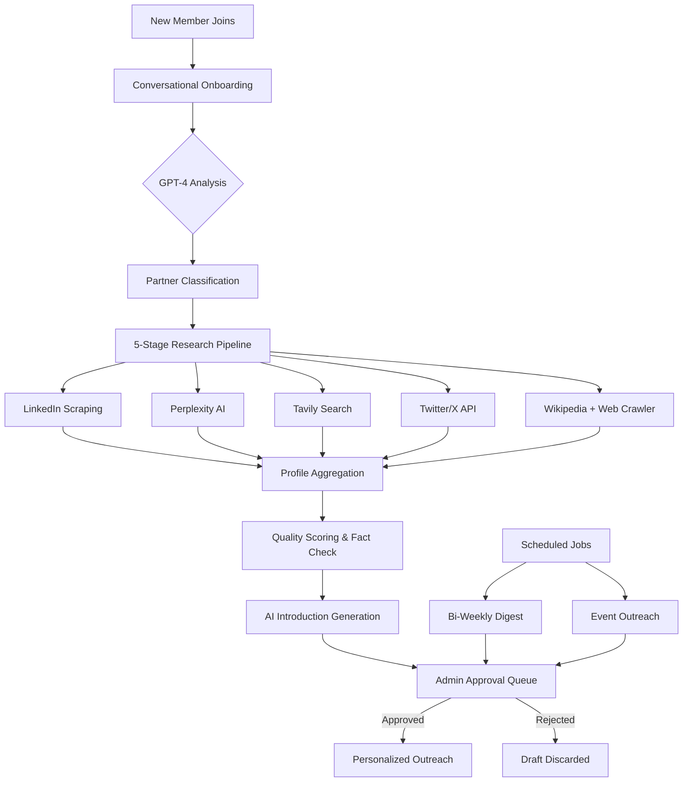

<div align="center">

# Sentinel

**AI-powered Slack bot for intelligent community management.**

Automated onboarding, multi-source research, and personalized outreach — with human-in-the-loop approval at every step.

<br />

[](https://nodejs.org/)
[](https://slack.dev/bolt-js/)
[](https://openai.com/)
[](https://www.prisma.io/)
[](LICENSE)
[](https://github.com/JiwaniZakir/sentinel/stargazers)
[](https://github.com/JiwaniZakir/sentinel/network/members)

<br />

</div>

---

## Overview

Sentinel is a Slack bot that automates the entire lifecycle of community member onboarding. When a new member joins, the bot conducts a natural, multi-turn GPT-4 conversation to learn about them, triggers a parallel research pipeline across six data sources, and generates a personalized introduction -- all within 60 seconds. Every outbound message passes through an admin approval queue, so the bot never sends anything unsanctioned.

---

## Features

- **Conversational Onboarding** -- Multi-turn GPT-4 interview that classifies members (VC, Corporate, Community Builder, Angel) through natural dialogue
- **5-Stage Research Pipeline** -- Parallel intelligence gathering across LinkedIn, Perplexity AI, Tavily, Twitter/X, Wikipedia, and web crawlers
- **Fact Verification** -- Cross-references claims across sources, assigns confidence scores, and flags contradictions
- **LinkedIn Intelligence** -- Account pooling across 12+ accounts with session persistence, AES-256-GCM encryption, and automated email verification
- **Personalized Introductions** -- GPT-4 synthesizes research and conversation data into tailored introductions with key talking points
- **Event Outreach** -- Generates individualized event invitations based on each member's profile and interests
- **Bi-Weekly Digest** -- Automated community roundup with highlights, event recaps, and new member spotlights
- **Human-in-the-Loop Approval** -- All outgoing communications are queued in `#bot-admin` for explicit admin review before delivery

---

## Architecture



<details>
<summary><strong>Pipeline Stages in Detail</strong></summary>
<br />

| Stage | What Happens | Time |
|-------|-------------|------|
| **1. Data Collection** | Parallel scraping across LinkedIn, Perplexity, Tavily, Twitter, Wikipedia, and web crawlers | 30-45s |
| **2. Citation Crawling** | Follows references from initial results to build a complete picture | 5-10s |
| **3. Quality & Fact Check** | Cross-references claims across sources, flags contradictions | < 1s |
| **4. Profile Aggregation** | Merges data into unified person and firm profiles with confidence scores | < 1s |
| **5. Introduction Generation** | GPT-4 synthesizes a personalized introduction with key talking points | < 1s |

</details>

---

## Tech Stack

<table>
<tr>
<td>

| Layer | Technology |
|-------|-----------|
| **Runtime** | Node.js 20+ |
| **Framework** | Slack Bolt SDK (Socket Mode) |
| **AI** | OpenAI GPT-4 / GPT-4o |
| **Database** | PostgreSQL + Prisma ORM |

</td>
<td>

| Layer | Technology |
|-------|-----------|
| **Research** | Perplexity AI, Tavily, Twitter API v2, Wikipedia |
| **Scraping** | Python Selenium + Chromium |
| **Security** | AES-256-GCM encryption |
| **Deployment** | Railway (Nixpacks) |

</td>
</tr>
</table>

---

## Quick Start

### Prerequisites

- Node.js 20+
- PostgreSQL
- Slack workspace (Pro or Business+)
- OpenAI API key

### 1. Clone and install

```bash
git clone https://github.com/JiwaniZakir/sentinel.git
cd sentinel
npm install
```

### 2. Configure environment

```bash
cp .env.example .env
# Edit .env with your Slack, OpenAI, and database credentials
```

### 3. Set up the database

```bash
npx prisma generate
npx prisma db push
```

### 4. Create the Slack app

1. Create an app at [api.slack.com/apps](https://api.slack.com/apps)
2. Enable **Socket Mode**
3. Add Bot Token Scopes:

   ```
   channels:join  channels:manage  channels:read  chat:write  chat:write.public
   groups:read  groups:write  im:history  im:read  im:write
   users:read  users:read.email  commands  files:write
   ```

4. Subscribe to events: `team_join`, `member_joined_channel`, `app_home_opened`, `message.im`
5. Install to workspace and copy tokens to `.env`

### 5. Start the bot

```bash
# Development
npm run dev

# Production
npm start
```

---

## Slash Commands

| Command | Description |
|---------|------------|
| `/sentinel help` | Show available commands |
| `/sentinel intro` | Start or redo onboarding |
| `/sentinel events` | View upcoming events |
| `/sentinel announce-event` | Create event outreach *(admin)* |
| `/sentinel send-digest` | Generate community digest *(admin)* |
| `/sentinel add-highlight <text>` | Add content to digest *(admin)* |
| `/sentinel partner-stats` | View pipeline statistics *(admin)* |

---

## Project Structure

```
sentinel/
├── src/
│   ├── index.js                    # Server initialization
│   ├── app.js                      # Bolt app configuration
│   ├── config/                     # Environment & settings
│   ├── listeners/
│   │   ├── events/                 # member_joined, app_home_opened
│   │   ├── messages/               # DM conversation handler
│   │   ├── actions/                # Approval buttons, modals
│   │   └── commands/               # Slash command router
│   ├── services/
│   │   ├── openai.js               # GPT-4 integration
│   │   ├── database.js             # Prisma operations
│   │   ├── slack.js                # Slack API helpers
│   │   ├── scheduler.js            # Cron job management
│   │   └── research/
│   │       ├── index.js            # Pipeline orchestrator
│   │       ├── accountPool.js      # LinkedIn account rotation
│   │       ├── sessionManager.js   # Session persistence + encryption
│   │       ├── emailVerification.js
│   │       ├── linkedin.js
│   │       ├── perplexity.js
│   │       ├── tavily.js
│   │       ├── twitter.js
│   │       ├── wikipedia.js
│   │       ├── crawler.js          # Citation web crawler
│   │       ├── aggregator.js       # Multi-source profile merger
│   │       ├── qualityScorer.js    # Cross-reference validation
│   │       └── introGenerator.js   # AI introduction synthesis
│   ├── prompts/                    # System prompt templates
│   ├── templates/                  # Slack Block Kit templates
│   └── utils/                      # Logger, validators, formatters
├── prisma/
│   └── schema.prisma               # Database schema (15 tables)
├── scripts/
│   ├── scrape_linkedin.py          # Selenium scraper
│   └── wikipedia_search.py         # Wikipedia search utility
└── docs/                           # Setup & architecture guides
```

---

## Research Pipeline Setup

The research pipeline is optional but provides the most value. To enable full intelligence:

1. **Generate an encryption key** -- run `/sentinel linkedin-generate-key` in Slack
2. **Add LinkedIn accounts** -- see the [LinkedIn Quick Start](docs/LINKEDIN_SESSION_MANAGER_QUICKSTART.md)
3. **Configure API keys** in `.env`:

   ```bash
   SESSION_ENCRYPTION_KEY=<generated-key>
   PERPLEXITY_API_KEY=<key>
   TAVILY_API_KEY=<key>
   TWITTER_BEARER_TOKEN=<optional>
   ```

---

## Documentation

| Guide | Description |
|-------|------------|
| [Onboarding Flow Guide](docs/ONBOARDING_FLOW_GUIDE.md) | Complete conversation flow documentation |
| [Research Architecture](docs/RESEARCH_ARCHITECTURE.md) | 5-stage pipeline deep-dive |
| [LinkedIn Quick Start](docs/LINKEDIN_SESSION_MANAGER_QUICKSTART.md) | 15-minute LinkedIn setup |
| [LinkedIn Full Setup](docs/LINKEDIN_SESSION_MANAGER_SETUP.md) | Complete account pool documentation |
| [Production Checklist](docs/PRODUCTION_CHECKLIST.md) | Deployment guide |
| [Twitter Setup](docs/TWITTER_SETUP.md) | Twitter API integration |

---

## Contributing

Contributions are welcome. Please follow these steps:

1. Fork the repository
2. Create a feature branch (`git checkout -b feature/your-feature`)
3. Commit your changes (`git commit -m "Add your feature"`)
4. Push to the branch (`git push origin feature/your-feature`)
5. Open a Pull Request

Please make sure your code follows the existing style and includes appropriate error handling.

---

## License

This project is licensed under the [MIT License](LICENSE).

---

<div align="center">

Built by [Zakir Jiwani](https://github.com/JiwaniZakir)

</div>
