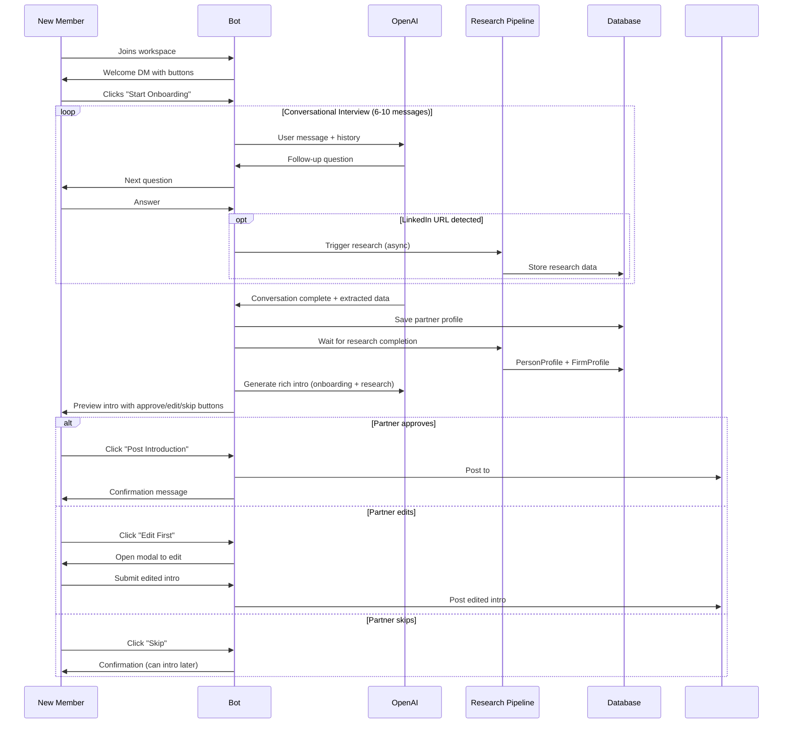

# Complete Onboarding Flow Guide

This guide explains the full partner onboarding flow with AI conversation and research integration.

## Overview

The onboarding flow is a **5-step process** that:
1. Welcomes new partners with a DM
2. Conducts a conversational interview using GPT-4
3. Automatically triggers background research (LinkedIn, Perplexity, etc.)
4. Generates a personalized introduction combining conversation + research
5. Posts to `#introductions` after partner approval

## Architecture



## Step-by-Step Flow

### Step 1: Welcome Message

**Trigger:** New member joins workspace or `#introductions` channel

**Code:** `src/listeners/events/memberJoined.js`

The bot sends a DM with 3 buttons:
- 🚀 **Start Onboarding** (primary)
- ⏰ **Maybe Later** (dismisses, but can restart)
- ⏭️ **Skip** (opts out)

**Example:**
```
Hey John! 👋

Welcome to The Foundry! We're thrilled to have you join our community of 
partners supporting early-stage founders.

I'd love to learn a bit about you so we can connect you with the right 
founders and opportunities. It's a quick 3-minute chat.

[🚀 Start Onboarding] [⏰ Maybe Later] [⏭️ Skip]
```

### Step 2: Conversational Interview

**Code:** `src/listeners/messages/dmHandler.js` + `src/services/openai.js`

When the user clicks "Start Onboarding" or says "ready", the bot begins a natural, multi-turn conversation using GPT-4.

**Conversation Goals:**
- Get LinkedIn profile URL (early in conversation)
- Understand partner type (VC, Corporate, Community Builder, Angel)
- Learn their story and what makes them unique
- Discover specific interests, thesis, and goals
- Gather personal details for a warm introduction

**Example Conversation:**

```
Bot: Great! Let's get started. First, what's your LinkedIn? 
     It helps me understand your background better.

User: https://www.linkedin.com/in/john-smith/

Bot: ✨ Perfect! I'm gathering some information about you in the 
     background to make your introduction extra special. This won't 
     slow down our conversation - we can keep chatting!
     
     So tell me, what type of partner are you? (VC, Corporate, 
     Community Builder, or Angel)

User: I'm a VC at Acme Ventures

Bot: Love it! What stage do you typically focus on?

User: We do seed and Series A, mostly in fintech and AI

Bot: That's interesting - what drew you to fintech specifically?

User: I actually built a fintech startup before becoming an investor...
     [conversation continues naturally for 6-10 exchanges]

Bot: Thanks so much, John! I've got everything I need. Give me just
     a moment to put together your introduction...
```

**What Happens Behind the Scenes:**
- OpenAI GPT-4 manages the conversation flow
- When LinkedIn URL is detected, background research triggers automatically
- Conversation data is saved to `onboarding_conversations` table
- OpenAI determines when conversation is complete
- Extracts structured data from natural language

### Step 3: Background Research (Automatic)

**Code:** `src/listeners/messages/dmHandler.js` (function: `triggerResearchAsync`)

**Trigger:** LinkedIn URL detected in conversation

The bot automatically runs a **5-stage research pipeline** in the background:

#### Stage 1: Data Collection
- LinkedIn profile scraping (via account pool)
- Perplexity person background
- Perplexity firm research
- Tavily social profile search
- Twitter/X profile (if username detected)
- Wikipedia person + company

#### Stage 2: Citation Crawling
- Crawls all citation URLs from Perplexity
- Extracts additional facts from articles

#### Stage 3: Quality & Fact Checking
- Scores data quality (0-100%)
- Cross-references facts across sources
- Identifies verified vs. disputed facts

#### Stage 4: Profile Aggregation
- Creates `PersonProfile` (unified person data)
- Creates `FirmProfile` (unified company data)
- Merges onboarding data with research data
- Prioritizes self-reported data over external data

#### Stage 5: Introduction Generation (skipped during onboarding)
- Introduction is generated AFTER onboarding completes
- Uses both onboarding conversation AND research

**Research Progress Indicator:**
```
⏳ Research still running in background...
```

When complete:
```
🔬 Research Quality: 87% (12 sources analyzed)
```

### Step 4: Introduction Generation

**Code:** `src/listeners/messages/dmHandler.js` (function: `handleOnboardingComplete`)

Once the conversation is complete, the bot generates a rich introduction:

**Data Sources (Priority Order):**
1. **PersonProfile** (if research completed) - Most comprehensive
2. **ResearchSummary** (if quick research) - Fallback
3. **Onboarding Data** (always available) - Baseline

**Generation Methods:**

#### Method 1: Rich Intro (Full Pipeline)
Uses `research.intro.generateRichIntro()`:
- Combines PersonProfile + FirmProfile
- Includes verified facts
- References onboarding conversation
- Adds personality and warmth

#### Method 2: Fallback Intro (Quick Research)
Uses `openai.generateIntroMessage()` with research context:
- Uses ResearchSummary from Stage 1
- Combines with onboarding data

#### Method 3: Baseline Intro (No Research)
Uses only onboarding conversation data

**Example Introduction:**

```
🎉 Thanks for completing your onboarding, John!

Would you like to introduce yourself to the community in our 
#introductions channel?

━━━━━━━━━━━━━━━━━━━━━━━━━━━━
Here's a draft introduction based on our conversation:

🔬 Research Quality: 87% (12 sources analyzed)
━━━━━━━━━━━━━━━━━━━━━━━━━━━━

> Meet John Smith — a seed-stage fintech investor at Acme Ventures 
> who brings a unique founder perspective to the table. Before 
> investing, John built and exited PayFlow, a payments startup that 
> processed over $2B in transactions.
> 
> At Acme, John focuses on early-stage fintech companies reimagining 
> financial infrastructure. He's particularly excited about embedded 
> finance and real-time payments. Recent investments include FastPay 
> and CreditFlow.
> 
> Fun fact: John is an avid rock climber and thinks about investing 
> in terms of "finding the hidden route that others don't see."
> 
> Looking to connect with: Technical founders in fintech, especially 
> those with B2B SaaS models tackling compliance or infrastructure.

[✅ Post Introduction] [✏️ Edit First] [⏭️ Skip]
```

### Step 5: Partner Approval

**Code:** `src/listeners/actions/onboarding.js`

The partner has 3 options:

#### Option A: Post Introduction
- Button: "✅ Post Introduction"
- Action: `partner_approve_intro`
- Posts to `#introductions` immediately
- Marks onboarding as complete
- Notifies #bot-admin

#### Option B: Edit First
- Button: "✏️ Edit First"
- Action: `partner_edit_intro`
- Opens modal with editable text
- Posts edited version to `#introductions`
- Marks onboarding as complete

#### Option C: Skip
- Button: "⏭️ Skip"
- Action: `partner_skip_intro`
- Marks onboarding as complete
- No introduction posted
- Can introduce themselves later via `/partnerbot intro`

### Posted Introduction Format

**Channel:** `#introductions`

```
💰 Welcome @john-smith!

Meet John Smith — a seed-stage fintech investor at Acme Ventures 
who brings a unique founder perspective to the table. Before 
investing, John built and exited PayFlow, a payments startup that 
processed over $2B in transactions.

At Acme, John focuses on early-stage fintech companies reimagining 
financial infrastructure. He's particularly excited about embedded 
finance and real-time payments. Recent investments include FastPay 
and CreditFlow.

Fun fact: John is an avid rock climber and thinks about investing 
in terms of "finding the hidden route that others don't see."

Looking to connect with: Technical founders in fintech, especially 
those with B2B SaaS models tackling compliance or infrastructure.

─────────────────────────────
Acme Ventures • VC
```

## Configuration

### Required Environment Variables

```bash
# Slack
SLACK_BOT_TOKEN=xoxb-...
SLACK_SIGNING_SECRET=...

# OpenAI (for conversation)
OPENAI_API_KEY=sk-...

# Research (optional but recommended)
PERPLEXITY_API_KEY=...
TAVILY_API_KEY=...
SESSION_ENCRYPTION_KEY=... (for LinkedIn)
TWITTER_BEARER_TOKEN=... (optional)

# Channels
CHANNEL_INTRODUCTIONS=C01ABC123
CHANNEL_BOT_ADMIN=C02DEF456
CHANNEL_COMMUNITY=C03GHI789
```

### Slack Bot Scopes

Ensure your Slack app has these permissions:
```
chat:write         # Post messages
chat:write.public  # Post to channels
im:write           # Send DMs
im:history         # Read DM history
users:read         # Get user info
users:read.email   # Get user emails
```

### Event Subscriptions

Enable these events in your Slack app:
```
team_join                  # New workspace member
member_joined_channel      # Joined specific channel
message.im                 # DM messages
```

## Testing the Flow

### Test 1: Join Channel Trigger

1. Create a test user in your Slack workspace
2. Invite them to `#introductions` or `#community`
3. They should receive a welcome DM

### Test 2: Full Onboarding Conversation

```bash
# In Slack DM with bot:
1. Click "Start Onboarding"
2. Answer: "I'm a VC at Test Ventures"
3. Provide LinkedIn: "https://linkedin.com/in/test-user/"
4. Answer questions naturally
5. Wait for intro preview (1-2 minutes)
6. Click "Post Introduction"
7. Check #introductions for your intro
```

### Test 3: Test Command (Admin Only)

```
/partnerbot test-intro-flow
```

This simulates the entire flow in your DM without actually posting to channels.

### Test 4: Full Pipeline Test

```
/partnerbot test-full-pipeline https://linkedin.com/in/someone/
```

Tests the complete research + intro generation pipeline.

## Database Schema

### Partner Record
```sql
CREATE TABLE partners (
  id UUID PRIMARY KEY,
  slack_user_id TEXT UNIQUE,
  name TEXT,
  firm TEXT,
  partner_type ENUM,
  onboarding_complete BOOLEAN,
  onboarding_data JSONB,  -- Stores conversation + pending intro
  research_summary JSONB, -- Legacy research data
  research_status ENUM,   -- PENDING, IN_PROGRESS, SUCCESS, FAILED
  linkedin_url TEXT,
  ...
);
```

### Onboarding Conversation
```sql
CREATE TABLE onboarding_conversations (
  id UUID PRIMARY KEY,
  partner_id UUID REFERENCES partners(id),
  slack_user_id TEXT,
  messages JSONB,      -- Array of {role, content, timestamp}
  extracted_data JSONB, -- Partial data as conversation progresses
  status ENUM,         -- PENDING, IN_PROGRESS, COMPLETED, ABANDONED
  started_at TIMESTAMP,
  completed_at TIMESTAMP
);
```

### Person Profile (Research)
```sql
CREATE TABLE person_profiles (
  id UUID PRIMARY KEY,
  partner_id UUID UNIQUE REFERENCES partners(id),
  name TEXT,
  linkedin_url TEXT,
  headline TEXT,
  career_timeline JSONB,
  investment_thesis TEXT,
  notable_deals JSONB,
  fun_facts TEXT[],
  data_quality_score FLOAT,
  sources_used TEXT[],
  ...
);
```

## Customization

### Modify Conversation Style

Edit `src/prompts/onboarding.js`:
- Change tone (warm → formal, casual → professional)
- Add/remove questions
- Adjust conversation length
- Customize for different partner types

### Modify Introduction Format

Edit `src/services/research/introGenerator.js`:
- Change introduction structure
- Adjust length (default: 250 words)
- Add/remove sections
- Change tone/style

### Modify Welcome Message

Edit `src/templates/welcomeDM.js`:
- Change button text
- Add custom messaging
- Adjust branding

## Troubleshooting

### Issue: No welcome DM sent
- **Check:** Event subscriptions enabled?
- **Check:** Bot in `#introductions` channel?
- **Check:** User already onboarded?

### Issue: Conversation not starting
- **Check:** OpenAI API key configured?
- **Check:** Database connection working?
- **Check:** Check Railway logs

### Issue: Research not triggering
- **Check:** LinkedIn URL provided in correct format?
- **Check:** Research API keys configured?
- **Check:** LinkedIn accounts in pool available?

### Issue: Introduction not generated
- **Check:** Research completed successfully?
- **Check:** OpenAI API working?
- **Check:** Check logs for intro generation errors

### Issue: Can't post to #introductions
- **Check:** `CHANNEL_INTRODUCTIONS` env var set?
- **Check:** Bot has `chat:write.public` scope?
- **Check:** Bot member of channel?

## Monitoring

### Check Onboarding Status

```sql
-- Active onboardings
SELECT * FROM onboarding_conversations 
WHERE status = 'IN_PROGRESS';

-- Completed onboardings today
SELECT COUNT(*) FROM partners 
WHERE onboarding_complete = TRUE 
AND updated_at > NOW() - INTERVAL '1 day';
```

### Check Research Success Rate

```sql
-- Research completion rate
SELECT 
  research_status,
  COUNT(*) as count
FROM partners
WHERE research_status IS NOT NULL
GROUP BY research_status;
```

### Slack Commands for Monitoring

```bash
# Admin dashboard (coming soon)
/partnerbot stats

# Test onboarding components
/partnerbot test-onboarding
```

## Best Practices

1. **Test with Real Accounts**: Use real LinkedIn profiles during testing
2. **Monitor Research Quality**: Check quality scores and adjust sources
3. **Review Introductions**: Admin should review first few intros
4. **Adjust Conversation**: Tune prompts based on partner feedback
5. **Track Metrics**: Monitor completion rates and drop-off points

## Next Steps

1. ✅ Deploy to Railway
2. ✅ Configure environment variables
3. ✅ Set up LinkedIn account pool
4. ✅ Test with real users
5. ✅ Monitor and iterate

## Support

For issues:
1. Check Railway logs
2. Run test commands
3. Review this documentation
4. Check database for stuck records

